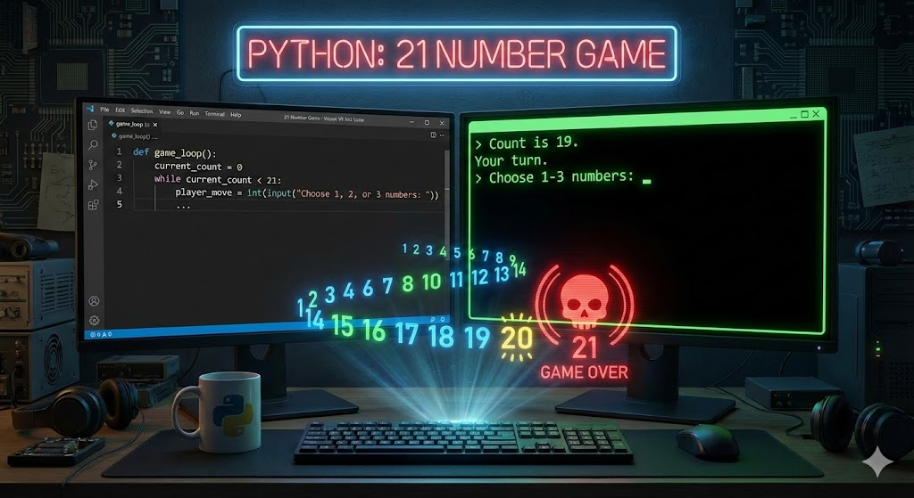

# 21 NUMBER GAME


A simple Python implementation of the classic counting game.

## Rules

1. The game starts at **0**.
2. Players take turns adding **1**, **2**, or **3** to the current count.
3. The player who is forced to say **21** loses the game.

## How to Run

Navigate to the folder and run the script:

```bash
python main.py
```

Can you beat the computer strategy? Hint: Try to land on multiples of 4!
