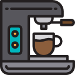

# COFFEE MACHINE PROGRAM

## ABOUT

The program prompts the user to select a drink, such as espresso, latte, or cappuccino, and checks if there are enough resources to make the selected drink. If there are sufficient resources, the program prompts the user to insert coins and calculates the monetary value of the coins. The program then checks if the user has inserted enough money to purchase the selected drink, and offers change if the user has inserted too much money. Finally, the program deducts the resources required to make the selected drink and adds the cost of the drink to the machine's profit. The program also includes a report feature that displays the current resource values and profit. Overall, the program aims to provide a realistic simulation of a coffee machine that can be used to purchase a variety of drinks.

### NO DEPENDENCIES

# 🥳