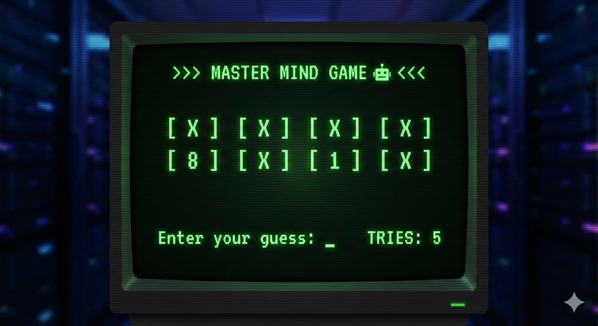

# Master Mind Game 🧠

A logic-based number guessing game built with Python. The computer selects a secret 4-digit number, and your goal is to guess it!

## 📋 Features

* **Randomized Challenge:** Every game starts with a new random 4-digit number.
* **Visual Feedback:** Correctly guessed digits are revealed in their specific positions (e.g., `X 2 X 9`).
* **Input Validation:** Ensures you enter valid 4-digit numbers.
* **Give Up Option:** Type 'z' if you get stuck to reveal the answer.
* **Score Tracking:** Counts the number of tries it takes to win.
* **Clean Interface:** Clears the screen for a focused experience.

## ⚙️ Prerequisites

You need to have **Python 3.x** installed on your machine.

## 🚀 How to Run

Navigate to the directory:

```bash
cd master-mind-game
```

Run the game:

```bash
python mmg.py
```

## 🕹️ How to Play

1. The computer generates a secret 4-digit number (between 1000 and 9999).
2. Enter your 4-digit guess.
3. If a digit is correct and in the right position, it will be revealed in the display (replacing the `X`).
4. If incorrect, try again!
5. Win by revealing all 4 digits.

## 📂 Project Structure

```text
.
├── mmg.py           # Main game script
└── README.md        # Project documentation
```

## 🛠️ Built With

* **Python** - Core logic
* **random** - Number generation
* **os** - Terminal clearing
