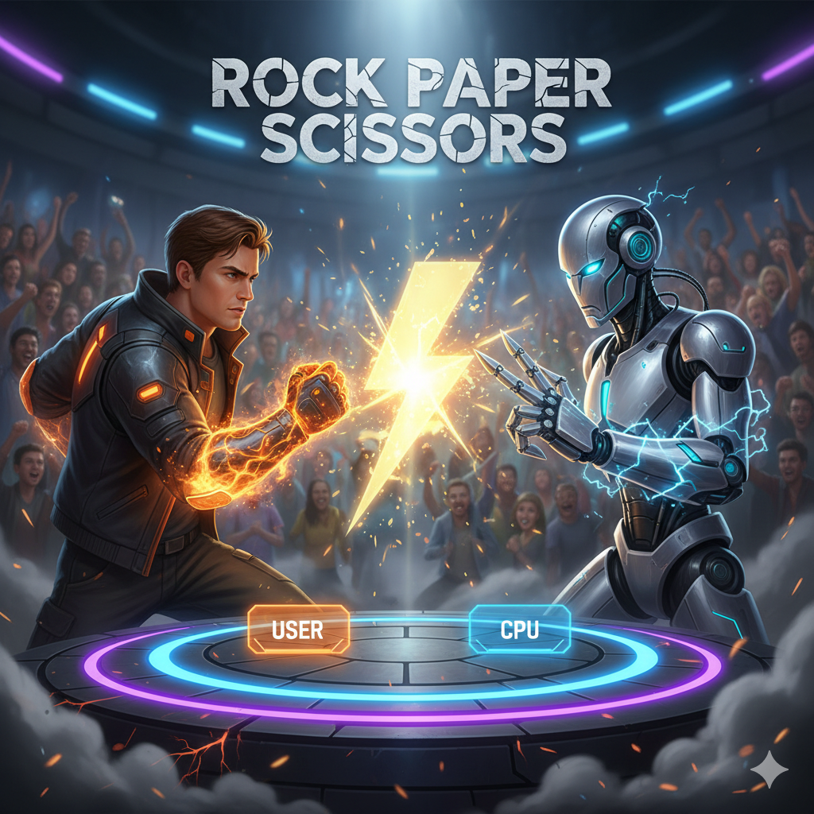

# Rock-Paper-Scissors Game 🎮

A classic Rock-Paper-Scissors game built with Python. Play against the computer in the command line with interactive prompts, emojis, and automatic screen clearing for a clean user experience.

## 📋 Features

* **Interactive Gameplay:** Play against a randomized computer opponent.
* **User Customization:** Enter your own name for a personalized experience.
* **Visual Feedback:** Uses emojis (🪨, 📄, ✂️) to make the console output engaging.
* **Smart Logic:**
    * Handles invalid inputs automatically.
    * Replays immediately if there is a tie.
    * Clears the console screen between turns for better readability.
* **Cross-Platform:** Works on Windows (`cls`) and Linux/macOS (`clear`).

## ⚙️ Prerequisites

You need to have **Python 3.x** installed on your machine.

You can check if Python is installed by running:
```
python --version
```
## 🚀 How to Run
Clone the repository (or download the rpsg.py file):

```
git clone [https://github.com/your-username/your-repo-name.git](https://github.com/your-username/your-repo-name.git)
Navigate to the directory:

Bash
cd your-repo-name
Run the game:

Bash
python rpsg.py
🕹️ How to Play
Launch the script.

Enter your Name when prompted.

Choose your weapon by typing the corresponding number:

Type 1 for Rock 🪨

Type 2 for Paper 📄

Type 3 for Scissor ✂️

The computer will reveal its choice.

Win Conditions:

Rock crushes Scissors

Scissors cuts Paper

Paper covers Rock

If it's a tie, the game restarts automatically!

```

## 📂 Project Structure

.
├── rpsg.py          # Main game script
└── README.md        # Project documentation
🛠️ Built With
Python - Core logic

Libraries used:

random (for computer choice generation)

time (for delays and suspense)

os (for clearing the terminal screen)

## 📝 License
This project is open-source and available for use.