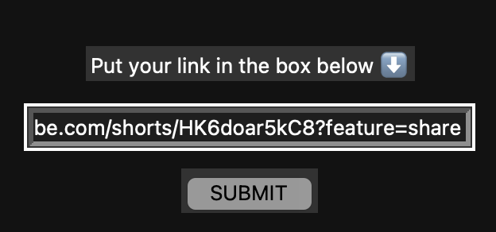
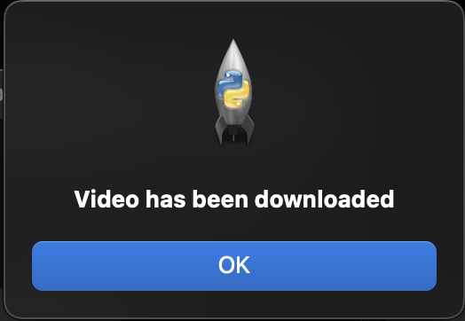

# VIDEO DOWNLOADER 

Hello, this is a simple python program with UI to download a youtube video. 

### Dependencies

**Pytube**

In order to install pytube make sure you have  alredy installed *python* and *pip* and enter in the console:

`pip install pytube`

**Tkinter**

Normally, Tkinter is already installed with python. If not. I have the solution for mac users. Make sure you have installed *homebrew* and enter in the console:

`brew install python-tk`

## How to use it

Run the program

`python video-downloader.py`

A window will appear

Follow the instructions.

Enter the youtube video link in the box and press the boton submit.

If a pop up appears with the message *Video has been downloaded" your video will be in the folder of this project!

